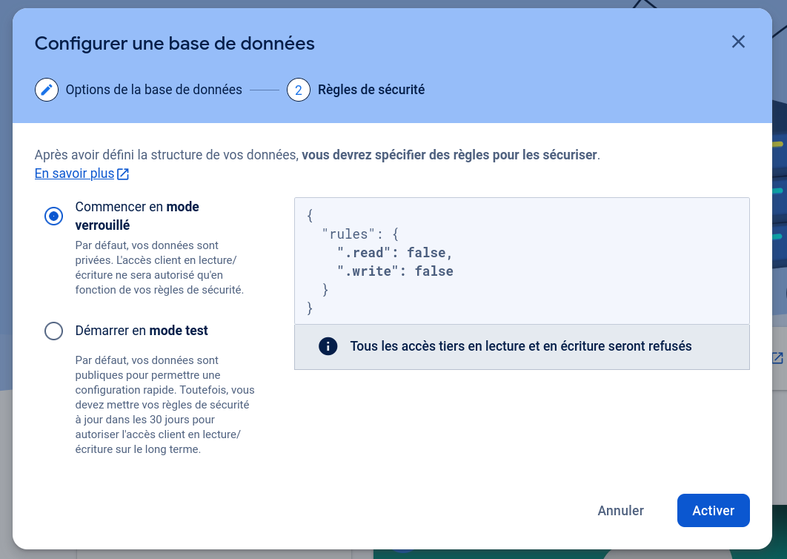
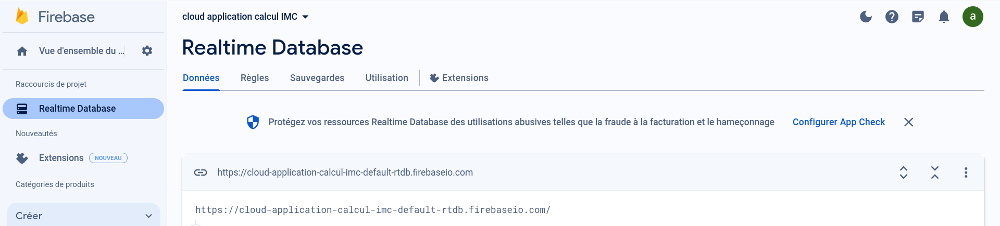
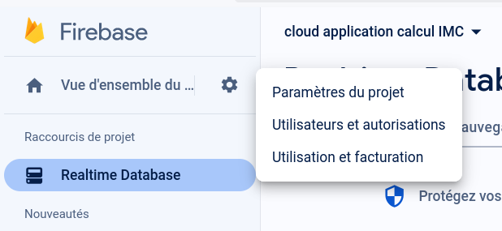
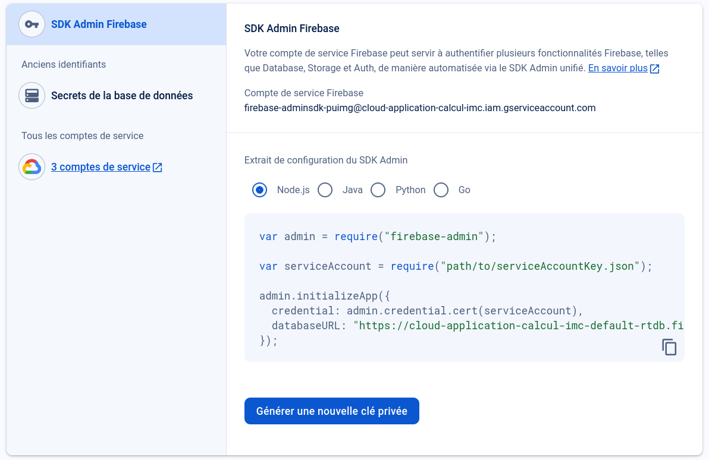
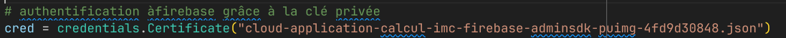
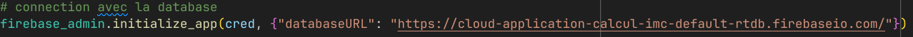

Introduction
-

Ce projet a pour but de créer une application cloud pour calculer l'indice de
masse corporel (IMC) des personnes.
L'application prend en entrée le nom, le poids et la taille de la personne, puis calcule la valeur de l'IMC. Ces informations
sont ensuite enregistrées dans une base de données en temps réel sur Firebase.
L'utilisateur peut aussi obtenir l'IMC d'une personne en entrant son nom.

Il a été réalisé par moi-même.

Préréquis
-

- Python 3.8.1 ou supérieur
- Un compte Google pour utiliser Firebase
- Module firebase_admin
- Une connection internet

Installation
-

- pip install firebase-admin

Changer la clé privée
-

Pour le bon fonctionnement de l'application il faut fournir la clé privée pour accéder à Firebase.
Pour cela il faut :

- Se connecter à Firebase depuis un compte google
- Cliquer sur ajouter un projet, s'en suit 3 étapes
 
  - Nommer le projet dans notre cas on peut l'appeller comme sur la photo : Cloud application calcul IMC
  - Accepter ou non Google Analytics (cela permet de fournir des rapports sur l'utilisation de la database) dans notre cas ce n'est pas très utile. Donc vous pouvez accepeter ou non.
  - Cliquer sur créer
- Une fois le projet créé, aller dans Built puis Realtime Database

- Cliquer sur Create Database
  - Sélectionner la localisation de la database (la plus proche de vous)
  - Sélectionner le mode pour la database
   
  - Dans le cadre de cette exemple, nous pouvons choisir test mode qui donne accès à toute personne possédant l'URL. Dans le cas d'une véritable utilisation de l'application, il faut sélectionner le locked mode
  - Cliquer sur créer la Database
- L'URL de la database est ici :
  
- Maintenant que la database est créée, il faut récupérer la clé privée
- Cliquer sur Porject overview puis la roue dentée puis sur project setting
  
- Cliquer sur service account
  
- Cliquer sur generate new private key, cela va télégarcher un file JSON qui nous servira à nous authentifier à Firebase

- Dans le fichier fonctions.py remplacer le nom du fichier JSON par celui téléchargé précèdement. Il faut que le fichier JSON soit stocké au même endroit que les fichiers fonctions.py et main.py
  
- Remplacer aussi l'URL pour quelle corresponde à l'URL de votre database
  

Exécuter le code
-

- Exécuter le fichier main.py
